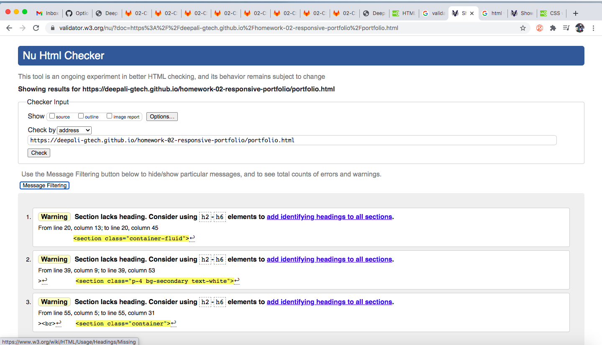

# homework-02-responsive-portfolio:

# Description 
Used Bootstrap CSS Framework to create a mobile responsive portfolio with the following items:
- A navbar
- A responsive layout
- Responsive images

Also, Bootstrap portfolio minimizes the use of media queries.

# Deployment

Link to the deployed website: https://deepali-gtech.github.io/homework-02-responsive-portfolio/

Below is the screen short for the website

# Validation
Used W3C HTML validation service - https://validator.w3.org/

## Finding Screenshots 

### index.html

### contact.html

### portfolio.html

## Screenshots after fixing the findings

### index.html

### contact.html

### portfolio.html
